# __ALU__

## **Contributors**

| [Abdelrahman Mohamed](https://github.com/Abd-ELrahmanHamza) | [Asmaa Adel]() | [Ziad Sherif](https://github.com/ZiadSheriif) | [Ziad Tarek](https://github.com/ZeyadTa) |
| :-----------------: | :-----------: | :---------: | :--------: |

## **Description**

* Design and implementation an arithmetic unit that is capable of adding, subtracting and multiplying two signed magnitude numbers, and displays the result of the operation performed along with some additional flags regarding the operation and the result using Logisim.

* The arithmetic unit takes two 5-bits signed magnitude inputs, A and B, and an additional input called Mode of Operation, which informs the arithmetic unit which function to perform on A and B:

    * Addition: Result = A + B
    
        During the addition A, B and Result are all 6-bits signed numbers.
    * Subtraction: Result = A - B
    
        During the subtraction A, B and Result are all 5-bits signed numbers.
    * Multiplication: Result = A * B

        During the multiplication A and B are 5-bits signed number and Result is 9-bits signed number.
        The multiplication of 4-bits by 4-bits yields a result of 8-bits, therefore Result is composed of 8-bits for the value and 1-bit for the sign.
    * Division: Result = A / B
        
        During the division A, B and Result are all 5-bits signed numbers. Our division is integer division, so we neglect the fraction part of the result.

* Flags
    * Sign Flag:
        
        The sign flag indicates if the result is negative. The flag is set to 1 if the result is negative and 0 otherwise.
    * Zero Flag:
        
        The zero flag indicates if the result is zero. The flag is set to 1 if the result is zero and 0 otherwise.
    * Div by Zero Flag:
        
        The divide by zero flag indicates if we divide by zero. The flag is set to 1 if B operand equal zero in division operation and 0 otherwise.
* Notes
    * The outputs (Result and sign flag should be displayed on 3 seven segments and the other outputs should be displayed on leds)
    * The input can be entered through switches
    * You need to implement circuit which can be used to convert from BCD to seven segments, you can use it in converting result to be displayed on seven segments.
    * You need to implement circuit which convert from binary to BCD
# Selectors

| Selector | operation|
| :-: | :------: |
| 00  | Addition |
| 01  | Subtraction |
| 10  | Division |
| 11  | Multiplication |

# Some inputs and outputs:

### 5 + 3 = 8

### 5 - 3 = 2
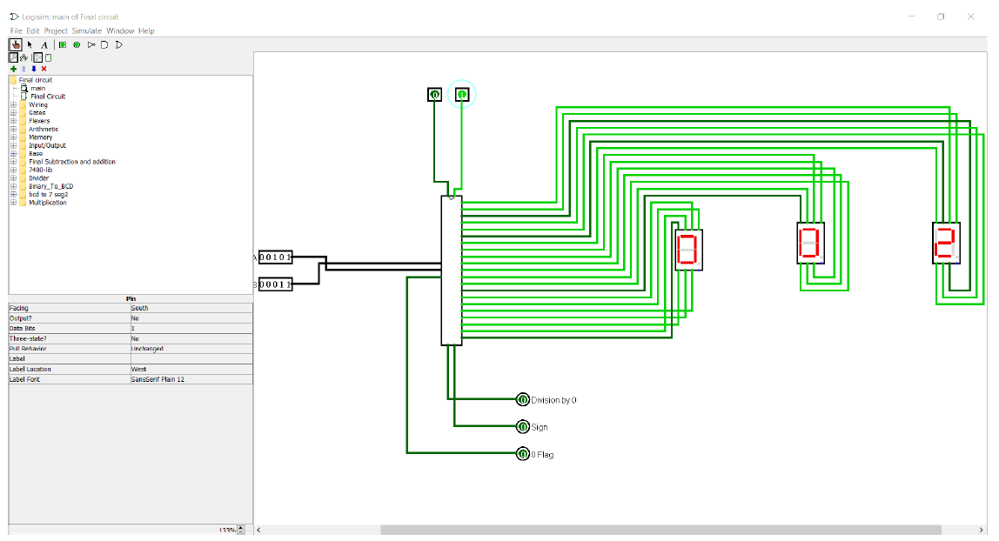
### 15 / -6 = -2
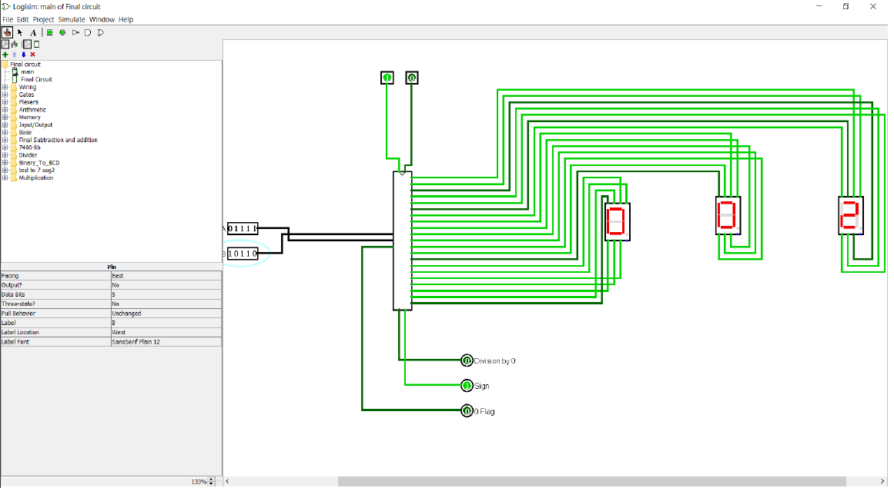
### 15 * -6 = -90
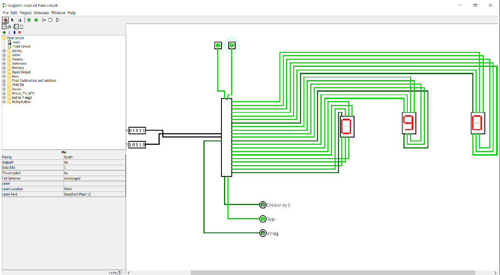

# Block diagrams & circuits: -

## Addition and subtraction 
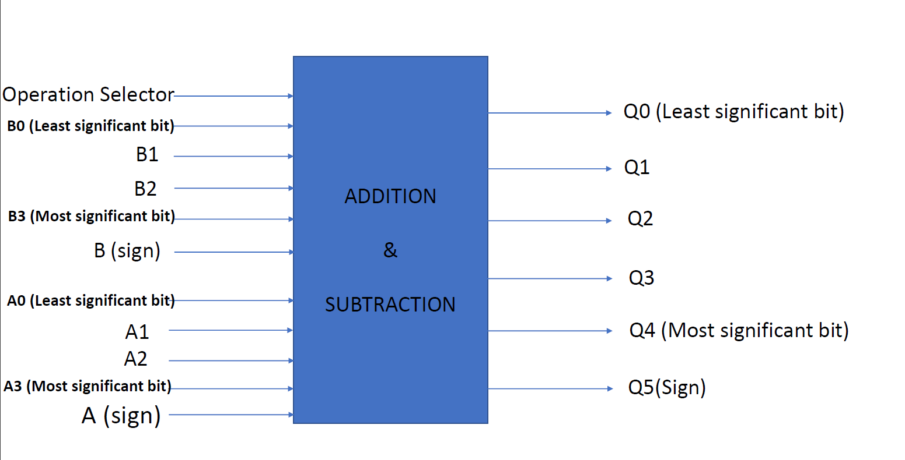

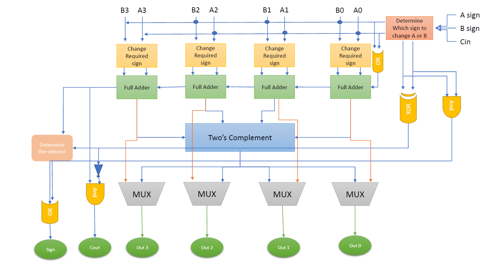

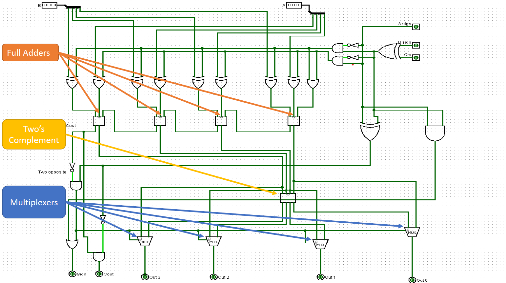

## Division
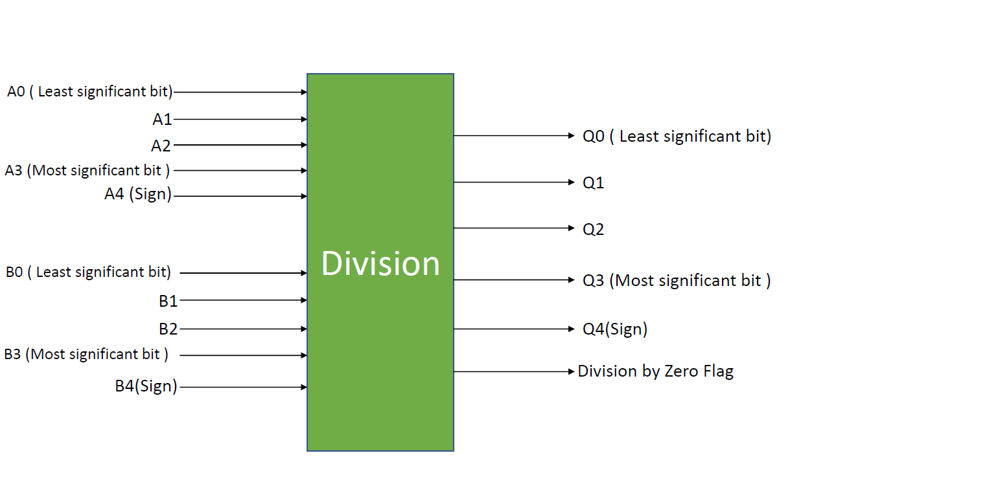

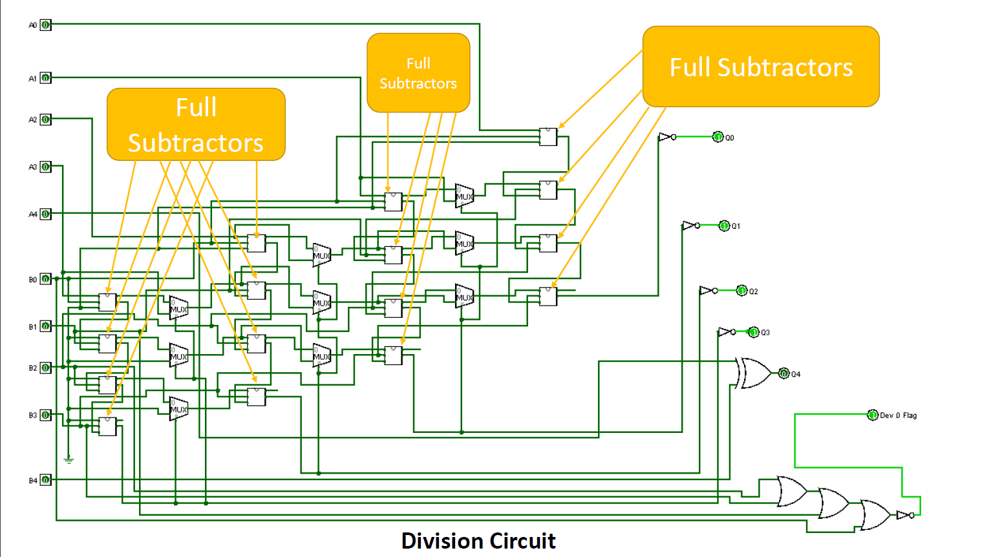

## BCD to 7-segments Display
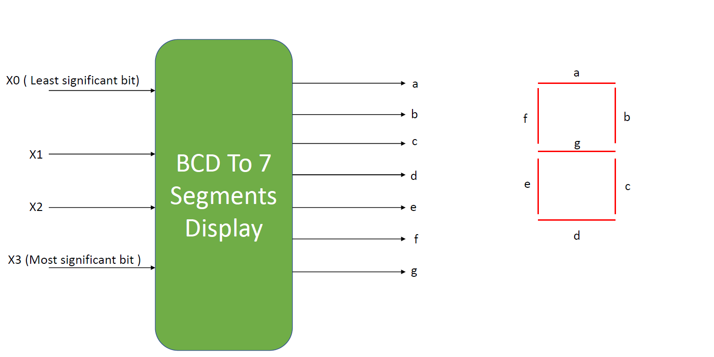

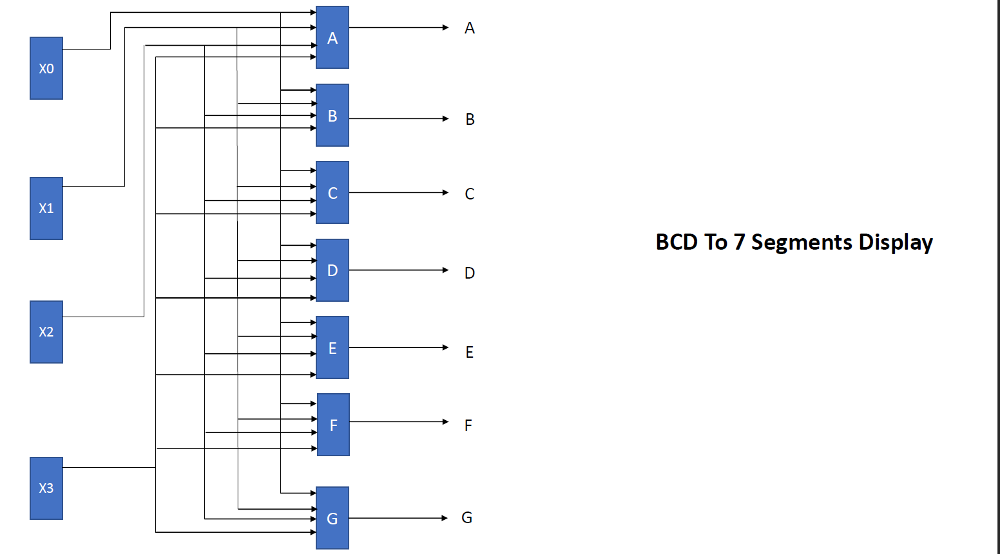

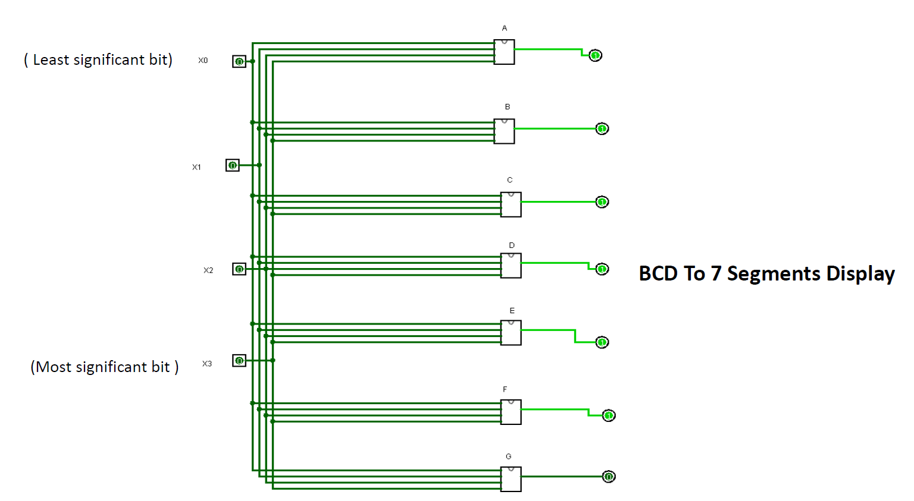

## Multiplication 

## Binary_to_BCD

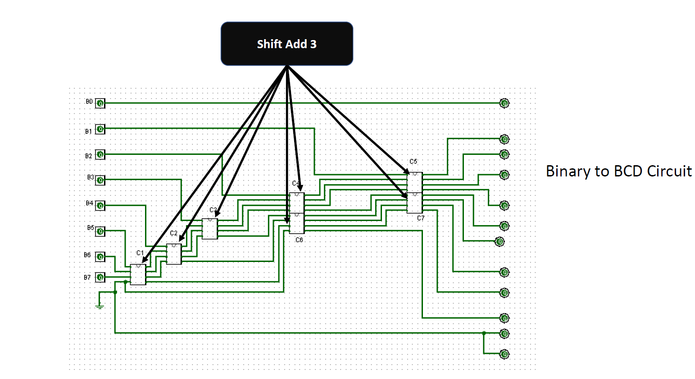

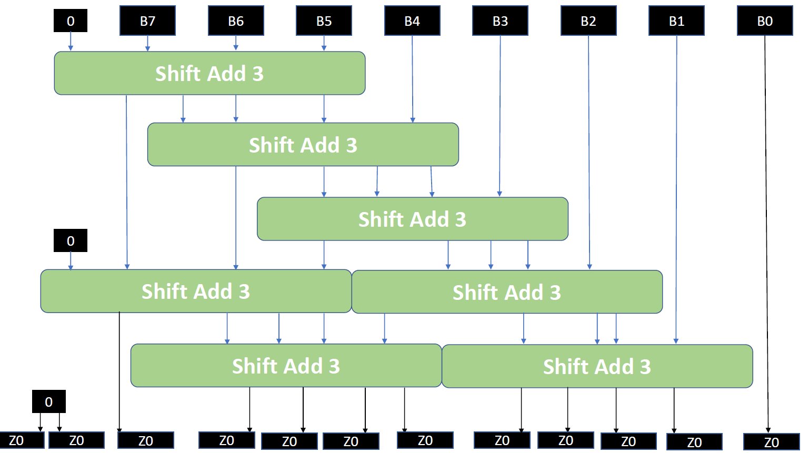

